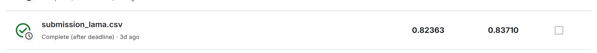
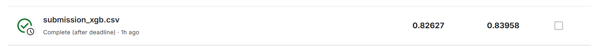

# Задание по курсу AutoML

Ссылка на данные - [Santander Customer Satisfaction](https://www.kaggle.com/competitions/santander-customer-satisfaction/overview)

## Описание задачи

> From frontline support teams to C-suites, customer satisfaction is a key measure of success. Unhappy customers don't stick around. What's more, unhappy customers rarely voice their dissatisfaction before leaving.
>
> Santander Bank is asking Kagglers to help them identify dissatisfied customers early in their relationship. Doing so would allow Santander to take proactive steps to improve a customer's happiness before it's too late.
>
> In this competition, you'll work with hundreds of anonymized features to predict if a customer is satisfied or dissatisfied with their banking experience.

Основная цель — построить модель, максимизирующую метрику **ROC AUC** (задача бинарной классификации).
Целевая переменная находится в колонке `TARGET` (значения 0 или 1).

## Структура репозитория

```
auto_ml/
├── data/
│   ├── train.csv              # Обучающая выборка
│   └── test.csv               # Тестовая выборка
├── model.ipynb                # Основной ноутбук с решением
├── eda.ipynb                  # Разведочный анализ данных
├── submission_lama.csv        # Предсказания LightAutoML
├── submission_xgb.csv         # Предсказания XGBoost
├── xgb_random_search_results.csv  # Результаты подбора гиперпараметров
└── README.md                  # Описание проекта
```

## Подходы

1. **LightAutoML** — автоматический подбор моделей и гиперпараметров (две конфигурации)
2. **XGBoost** — ручной random search с 10-fold кросс-валидацией и early stopping

## Результаты на Kaggle (private + public)

Удалось победить LAMA с помощью XGBoost:

### LightAutoML


### XGBoost
